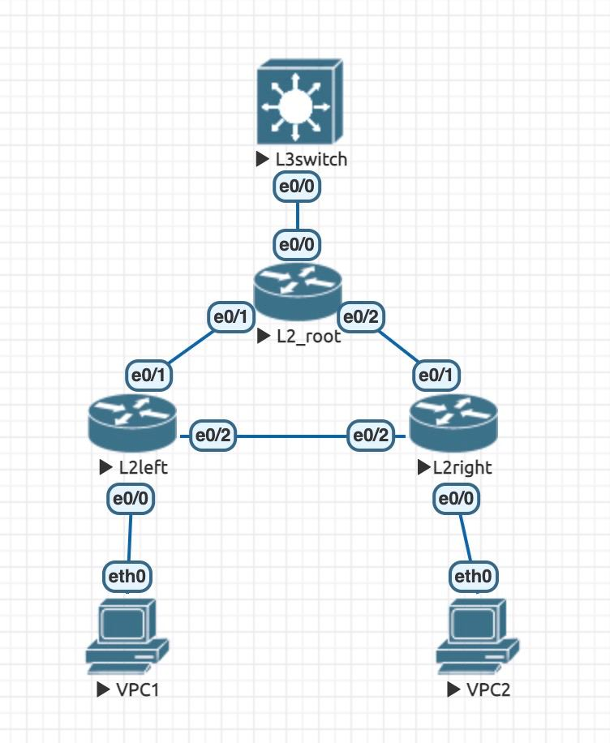
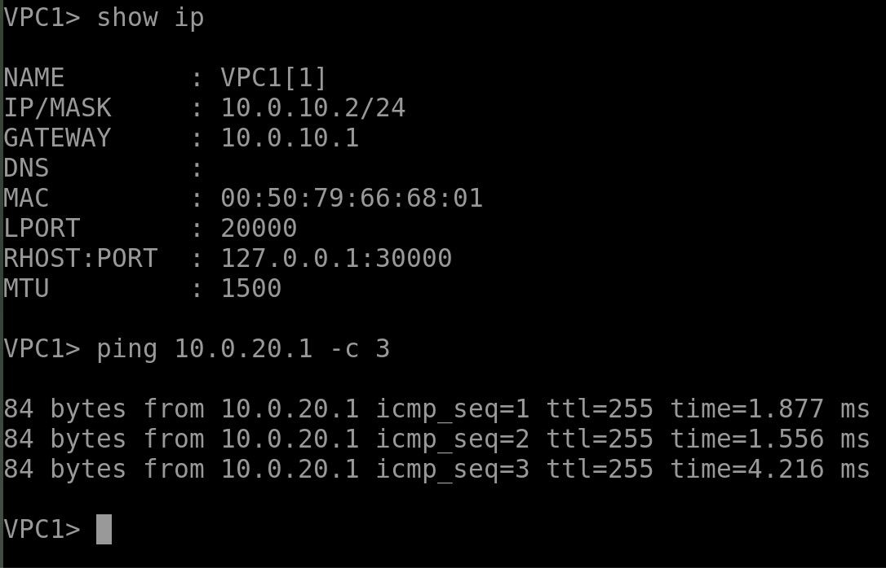
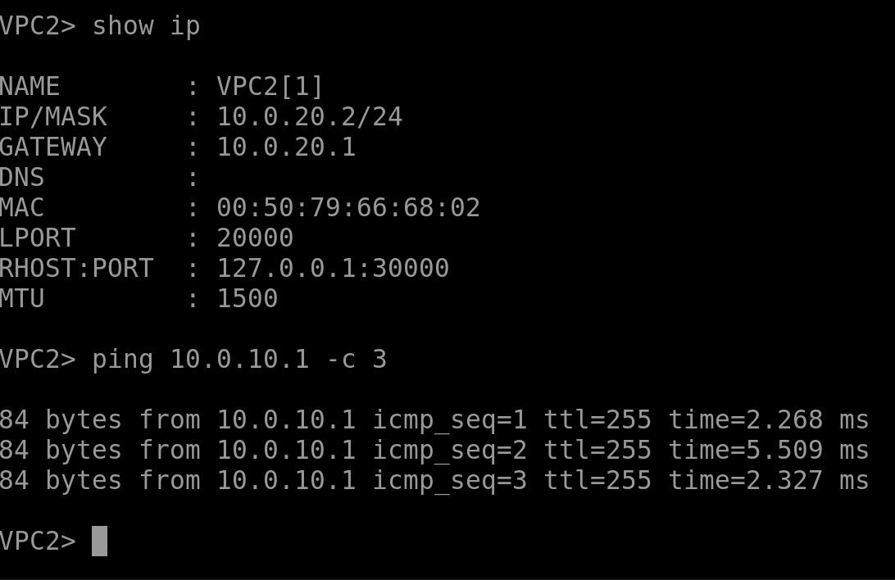
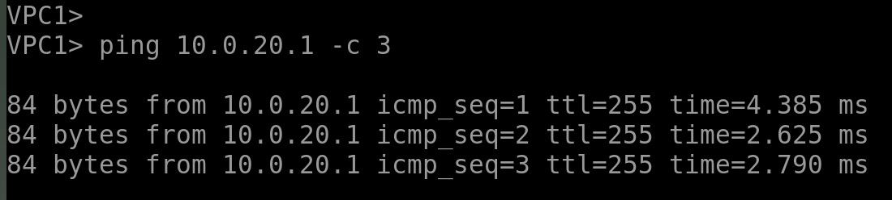

## Топология

## Конфигурация
Все конфигурационные файлы лежат в папке `configs/`

## Ping VPC1 —> VPC2

## VPC2

## Ping VPC2 —> VPC1

## Отказоустойчивость
При отключении интерфейса `L2left - L2_root` или `L2left - L2right` пинги всё равно успешно доходят

